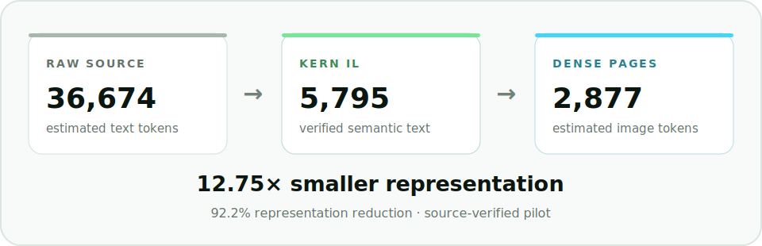

<p align="center">
  <picture>
    <source media="(prefers-color-scheme: dark)" srcset=".github/assets/kern-wordmark-dark.svg">
    <source media="(prefers-color-scheme: light)" srcset=".github/assets/kern-wordmark-light.svg">
    
  </picture>
</p>

<p align="center">
  <strong>Compile large codebases for machine attention.</strong><br>
  Lazy semantic context for repositories too large to keep raw in a model window, with an exact-source path before every write.
</p>

<p align="center">
  <a href="CHANGELOG.md"></a>
  <a href="https://github.com/enoch3712/KERN/actions/workflows/pages.yml"></a>
  <a href="LICENSE"></a>
  <a href="docs/install.md"></a>
</p>

<p align="center">
  <a href="https://enoch3712.github.io/KERN/">Website</a> ·
  <a href="#compression-first">Proof</a> ·
  <a href="#install">Install</a> ·
  <a href="#how-kern-works">How it works</a> ·
  <a href="https://enoch3712.github.io/KERN/docs/">Docs</a> ·
  <a href="CONTRIBUTING.md">Contributing</a>
</p>

---

KERN is designed for large codebases. It maintains a lazy, content-addressed intermediate-language mirror of a software repository, gives coding agents a compact semantic working set, recompiles files only when their contents change or become relevant, and faults authoritative source back into context before an edit.

## Compression first

<p align="center">
  <picture>
    <source media="(prefers-color-scheme: dark)" srcset=".github/assets/kern-proof-dark.svg">
    <source media="(prefers-color-scheme: light)" srcset=".github/assets/kern-proof-light.svg">
    
  </picture>
</p>

In the initial pilot, a 3,704-line Python file moved through three representations:

| Stage | Representation | Estimated tokens | Compression vs. source |
|---|---|---:|---:|
| Source | Authoritative Python | 36,674 | 1.00× |
| KERN IL | Verified semantic text | 5,795 | 6.33× |
| Dense | Two lossless-WebP IL pages | 2,877 | **12.75×** |

That is an estimated **92.2% representation reduction** from raw source to dense pages. The selected dense layout passed the pilot's five-fact retrieval check; a more aggressive 9 px layout drifted and is not recommended.

> [!IMPORTANT]
> These are representation estimates from one redacted pilot file—not total agent-loop savings. System instructions, tool schemas, reasoning, repeated turns, and resident context add cost. The retrieval check was small and compressor-selected; it is not a patch-correctness benchmark or a general accuracy claim.

Read the [methodology, fidelity observations, and limitations](benchmarks/README.md).

## Install

KERN packages one canonical skill for three coding-agent environments. Install it in each environment where you want to use it.

### Codex

```bash
codex plugin marketplace add enoch3712/KERN && codex plugin add kern@kern
```

Start a new task after installation. In the Codex desktop app, KERN can also be managed from the plugin directory.

### Claude Code

```bash
claude plugin marketplace add enoch3712/KERN --scope user && claude plugin install kern@kern --scope user
```

Start a new session, or reload plugins if the skill is not yet visible.

### Cursor

```bash
git clone --depth 1 https://github.com/enoch3712/KERN.git ~/.cursor/plugins/local/kern
```

Restart Cursor or run `Developer: Reload Window`.

For project-local installation, updates, uninstallation, and compiler-model routing, see the [installation guide](docs/install.md).

## Use it

KERN activates when an agent needs to understand a large repository, refresh changed context, answer from compressed code, or prepare an exact-source edit. A useful first request is:

```text
Use KERN to map this repository. Report changed, stale, and missing IR pages,
then load the architecture without editing source.
```

KERN creates a disposable `.kern/` mirror beside the repository:

```text
.kern/
├── manifest.json
├── config.json
├── ir/<source-path>.kern-il.txt
├── images/<source-path>/page-*.webp
├── jobs/<source-path>.job.json
└── staging/...
```

The directory carries its own ignore rule. Delete it at any time; KERN will rebuild it from source.

## How KERN works

| Phase | What happens |
|---|---|
| **1. Watch** | Scan source paths, hash current contents, and mark changed or deleted entries stale. |
| **2. Lower** | Create a deterministic baseline immediately; enrich only files that enter the semantic working set. |
| **3. Store** | Mirror textual KERN IL by source path and render cold IL into compact, lossless visual pages. |
| **4. Fault** | Load only the symbols, files, or pages required by the current task. |
| **5. Verify** | Re-read current source and require a matching content hash before an edit is committed. |

The compiler worker and runtime model are deliberately separate. A fast, economical model can lower high-volume source into KERN IL while the stronger runtime model spends its context on architecture, debugging, and implementation. Model selection remains host-configurable; KERN is the representation and cache contract, not a particular model.

## Design contracts

- **Source stays authoritative.** KERN IL and images are derived, untrusted context representations.
- **Stale context is rejected.** Manifest hashes and codec versions invalidate outdated IL and rendered pages.
- **Compilation is lazy.** Repository-wide hashing is cheap; model enrichment and image rendering happen for the active working set.
- **Writes fault exact source.** The agent must load current source with the expected hash before changing it.
- **The cache is local and disposable.** `.kern/` payloads are ignored by default and can be recreated.
- **Failure falls back safely.** If parsing or rendering fails, KERN retains textual context and returns to authoritative source.

KERN complements parsing, retrieval, tests, and version control. It does not replace them.

## Language and runtime coverage

Python receives a deterministic AST-based baseline. JavaScript, TypeScript, Go, Rust, Java, Kotlin, Swift, C, C++, C#, and other recognized source formats receive a deterministic generic baseline before optional compiler-model enrichment. Unsupported text formats fall back to the generic representation and exact-source path.

| Environment | Distribution | Compiler selection |
|---|---|---|
| Claude Code | Native marketplace plugin | Agent profile or inherited model |
| Codex | Native plugin marketplace | Configurable compiler-agent template |
| Cursor | Local plugin | Agent profile or inherited model |

See [model routing](skills/kern/references/model-routing.md) for the host-specific controls.

## Documentation

- [Install, update, and choose models](docs/install.md)
- [Architecture and cache lifecycle](docs/architecture.md)
- [Benchmark methodology](benchmarks/README.md)
- [Security policy](SECURITY.md)
- [Changelog](CHANGELOG.md)

## Development

```bash
npm ci
npm run build
python3 -m py_compile skills/kern/scripts/kern_cache.py skills/kern/scripts/render_ir.py
python3 skills/kern/scripts/kern_cache.py --repo . scan
```

Read [CONTRIBUTING.md](CONTRIBUTING.md) before opening a pull request. KERN is an experimental open-source prototype; compatibility and the benchmark corpus will expand as the contracts stabilize.

## License

KERN is licensed under [Apache-2.0](LICENSE). Product, model, and programming-language marks belong to their respective owners; compatibility references do not imply endorsement.
